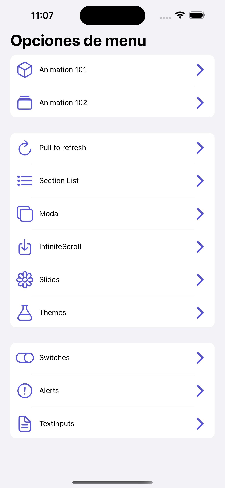
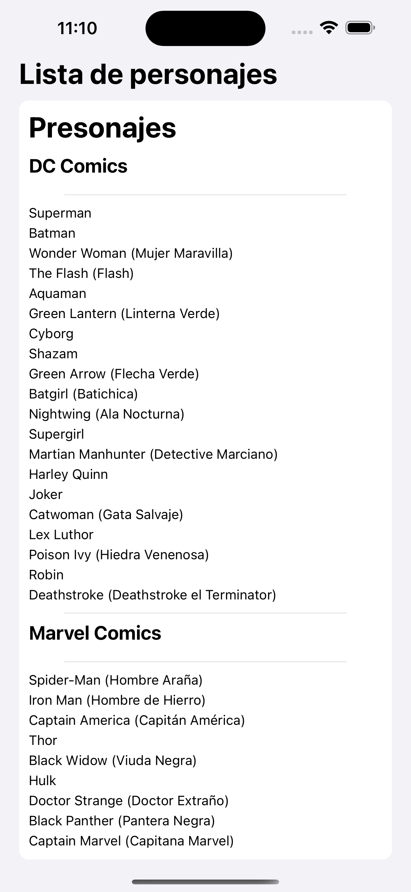

# ComponentsApp

Aplicación desarrollada en React Native que muestra el uso de diferentes componentes básicos y personalizados. Ideal para aprender y practicar conceptos fundamentales de React Native.

## Descripción

ComponentsApp es una app educativa que presenta ejemplos interactivos de componentes como botones, listas, formularios y más. Su objetivo es servir como referencia y punto de partida para nuevos proyectos en React Native.

## Pasos iniciales para subir la app en desarrollo

1. **Clona el repositorio:**

   ```bash
   git clone <URL-del-repositorio>
   cd 06-componentsApp
   ```

2. **Instala las dependencias:**

   ```bash
   npm install
   ```

3. **Ejecuta la app en modo desarrollo:**

   - Para iOS:
     ```bash
     npx react-native run-ios
     ```
   - Para Android:
     ```bash
     npx react-native run-android
     ```

4. **Sube los cambios al repositorio remoto:**
   ```bash
   git add .
   git commit -m "Subiendo versión inicial de la app"
   git push origin main
   ```

## Capturas de pantalla

_A continuación se mostrarán capturas de la aplicación en funcionamiento:_

<div  style="display:flex; justify-content:center; gap: 15px;">
     
    
</div>
